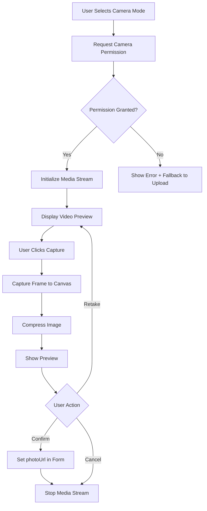

# Design Document - Camera Photo Capture

## Overview

This design document specifies the implementation of a camera capture feature for the student ID card generation application. The feature enables users to capture student photos directly through their device's camera as an alternative to file uploads, with particular emphasis on mobile device support (Safari iOS, Chrome Android) and desktop browsers.

### Key Design Goals

1. **Seamless Integration**: Integrate camera capture into the existing StudentForm component without disrupting current workflows
2. **Cross-Platform Compatibility**: Support Safari iOS 14.5+, Chrome Android 90+, and modern desktop browsers
3. **Resource Management**: Properly manage camera streams to prevent memory leaks and battery drain
4. **User Experience**: Provide intuitive UI with clear feedback for camera permissions, capture states, and errors
5. **Image Quality**: Maintain consistent image quality and format with existing photo upload functionality

### Technology Stack

- **React 19**: Component framework with hooks for state and lifecycle management
- **MediaDevices API**: `navigator.mediaDevices.getUserMedia()` for camera access
- **Canvas API**: Frame capture from video stream
- **Tailwind CSS**: Styling consistent with existing application design
- **Lucide React**: Icon library for UI elements

## Architecture

### Component Structure

The camera capture functionality will be implemented as a new component `CameraCapture` that integrates into the existing StudentForm component. This maintains separation of concerns while allowing seamless integration.

```
StudentForm (existing)
├── Photo Upload Section (modified)
│   ├── Mode Selector (new)
│   │   ├── Upload Button
│   │   └── Camera Button
│   ├── FileUpload (existing)
│   └── CameraCapture (new)
│       ├── CameraView
│       │   ├── VideoPreview
│       │   ├── CaptureButton
│       │   └── CameraSwitchButton
│       ├── PhotoPreview
│       │   ├── PreviewImage
│       │   ├── RetakeButton
│       │   └── ConfirmButton
│       └── ErrorDisplay
```

### State Management

The camera capture feature will manage the following state:

1. **Input Mode State**: Track whether user is in upload or camera mode
2. **Camera State**: Track camera initialization, active stream, and cleanup
3. **Capture State**: Track captured photo data and preview state
4. **Error State**: Track permission errors, device errors, and capture errors
5. **UI State**: Track loading states and user interactions

### Data Flow



## Components and Interfaces

### CameraCapture Component

**Purpose**: Manage camera access, video preview, photo capture, and resource cleanup.

**Props Interface**:
```typescript
interface CameraCaptureProps {
  onPhotoCapture: (photoDataUrl: string) => void;
  onCancel: () => void;
  existingPhotoUrl?: string;
}
```

**Internal State**:
```typescript
interface CameraCaptureState {
  stream: MediaStream | null;
  isInitializing: boolean;
  isCameraActive: boolean;
  capturedPhoto: string | null;
  error: CameraError | null;
  facingMode: 'user' | 'environment';
}

type CameraError = 
  | 'permission-denied'
  | 'device-not-found'
  | 'device-in-use'
  | 'capture-failed'
  | 'not-supported';
```

**Key Methods**:
- `initializeCamera()`: Request camera access and start media stream
- `capturePhoto()`: Capture current video frame to canvas and compress
- `switchCamera()`: Toggle between front and rear cameras (mobile only)
- `stopCamera()`: Stop all media stream tracks and cleanup
- `handleError()`: Process and display user-friendly error messages

### Modified StudentForm Component

**Changes Required**:
1. Add photo input mode state: `'upload' | 'camera'`
2. Add mode selector UI above photo input section
3. Conditionally render FileUpload or CameraCapture based on mode
4. Ensure camera cleanup on form cancel/submit

**Modified Photo Section Structure**:
```typescript
<div className="space-y-4">
  <label className="block text-sm font-semibold text-gray-700 mb-1">
    Photo de l'élève
  </label>
  
  {/* Mode Selector */}
  <div className="flex gap-2 mb-3">
    <button
      type="button"
      onClick={() => setPhotoInputMode('upload')}
      className={/* conditional styling */}
    >
      <Upload className="w-4 h-4" />
      Télécharger
    </button>
    <button
      type="button"
      onClick={() => setPhotoInputMode('camera')}
      className={/* conditional styling */}
    >
      <Camera className="w-4 h-4" />
      Prendre une photo
    </button>
  </div>

  {/* Conditional Rendering */}
  {photoInputMode === 'upload' ? (
    <FileUploadSection />
  ) : (
    <CameraCapture
      onPhotoCapture={(dataUrl) => setFormData({...formData, photoUrl: dataUrl})}
      onCancel={() => setPhotoInputMode('upload')}
      existingPhotoUrl={formData.photoUrl}
    />
  )}
</div>
```

### VideoPreview Component

**Purpose**: Display live camera feed with visual guides for photo framing.

**Implementation Details**:
- Use `<video>` element with `autoPlay`, `playsInline`, and `muted` attributes
- Set `srcObject` to MediaStream from getUserMedia
- Apply 3:4 aspect ratio constraint via CSS
- Add overlay frame guide to help users position subject
- Minimum size: 300x400px on desktop, responsive on mobile

### PhotoPreview Component

**Purpose**: Display captured photo with retake/confirm actions.

**Implementation Details**:
- Display captured image in same dimensions as video preview
- Provide "Reprendre" button to discard and restart camera
- Provide "Valider" button to confirm and set as student photo
- Ensure captured photo appears in StudentForm's live preview card

## Data Models

### MediaStream Constraints

```typescript
const cameraConstraints: MediaStreamConstraints = {
  video: {
    facingMode: 'user', // Default to front camera
    width: { ideal: 1280 },
    height: { ideal: 1280 },
    aspectRatio: { ideal: 1 } // Square capture for flexibility
  },
  audio: false
};
```

**Rationale**: Request square video at high resolution to allow flexible cropping to 3:4 portrait ratio. The `ideal` constraint allows browser to fall back to available resolutions.

### Camera Switching Constraints

```typescript
const switchToRearCamera: MediaStreamConstraints = {
  video: {
    facingMode: { exact: 'environment' },
    width: { ideal: 1280 },
    height: { ideal: 1280 }
  },
  audio: false
};
```

**Note**: Camera switching requires stopping the current stream and requesting a new one with different `facingMode`. The `applyConstraints()` method is not reliably supported for facingMode changes across browsers.

### Image Capture Format

The captured photo will use the same format as uploaded photos:
- **Dimensions**: 300x400 pixels (3:4 portrait ratio)
- **Format**: JPEG with 85% quality
- **Encoding**: Base64 data URL
- **Processing**: Reuse existing `compressImage()` function from StudentForm

## Error Handling

### Error Types and User Messages

| Error Type | Condition | User Message | Fallback Action |
|------------|-----------|--------------|-----------------|
| `not-supported` | `navigator.mediaDevices` undefined | "Votre navigateur ne supporte pas l'accès à la caméra" | Show upload option |
| `permission-denied` | User denies camera permission | "Accès à la caméra refusé. Veuillez autoriser l'accès dans les paramètres de votre navigateur" | Show upload option |
| `device-not-found` | No camera available | "Aucune caméra détectée sur cet appareil" | Show upload option |
| `device-in-use` | Camera used by another app | "La caméra est déjà utilisée par une autre application" | Show upload option |
| `capture-failed` | Canvas capture error | "Erreur lors de la capture. Veuillez réessayer" | Allow retry |

### Error Handling Strategy

1. **Graceful Degradation**: Always offer file upload as fallback
2. **Clear Messaging**: Provide actionable error messages
3. **Automatic Fallback**: Switch to upload mode on critical errors
4. **Retry Support**: Allow users to retry on transient errors
5. **Logging**: Log errors to console for debugging

### Error Detection Implementation

```typescript
const handleCameraError = (error: Error) => {
  console.error('Camera error:', error);
  
  if (error.name === 'NotAllowedError' || error.name === 'PermissionDeniedError') {
    setError('permission-denied');
  } else if (error.name === 'NotFoundError' || error.name === 'DevicesNotFoundError') {
    setError('device-not-found');
  } else if (error.name === 'NotReadableError' || error.name === 'TrackStartError') {
    setError('device-in-use');
  } else {
    setError('capture-failed');
  }
};
```

## Testing Strategy

### Unit Testing

Unit tests will focus on specific behaviors and edge cases:

1. **Component Rendering**
   - CameraCapture renders mode selector correctly
   - Video preview displays when camera is active
   - Photo preview displays after capture
   - Error messages display for each error type

2. **State Management**
   - Mode switching updates state correctly
   - Camera initialization sets stream state
   - Photo capture updates captured photo state
   - Error states trigger appropriate UI changes

3. **Resource Cleanup**
   - Media stream stops on component unmount
   - Media stream stops on mode switch
   - Media stream stops on photo confirmation
   - Media stream stops on form cancel

4. **Error Handling**
   - Permission denied shows correct error message
   - Device not found shows correct error message
   - Capture failure allows retry
   - Unsupported browser shows fallback

5. **Integration with StudentForm**
   - Captured photo populates formData.photoUrl
   - Captured photo appears in live preview card
   - Photo deletion works with captured photos
   - Form submission includes captured photo

### Integration Testing

Integration tests will verify end-to-end workflows:

1. **Complete Capture Flow**
   - User selects camera mode
   - Camera initializes successfully
   - User captures photo
   - User confirms photo
   - Photo appears in form and preview

2. **Camera Switching Flow** (mobile)
   - User switches to rear camera
   - Stream restarts with new camera
   - Capture works with rear camera

3. **Error Recovery Flow**
   - Permission denied triggers fallback
   - User switches to upload mode
   - Upload works normally

4. **Form Submission Flow**
   - User captures photo
   - User fills other form fields
   - Form submits with captured photo
   - Camera resources are cleaned up

### Manual Testing Checklist

**Desktop Browsers**:
- [ ] Chrome: Camera access, capture, and cleanup
- [ ] Firefox: Camera access, capture, and cleanup
- [ ] Edge: Camera access, capture, and cleanup
- [ ] Safari: Camera access, capture, and cleanup

**Mobile Browsers**:
- [ ] Safari iOS 14.5+: Front camera, capture, cleanup
- [ ] Safari iOS: Camera switching (front/rear)
- [ ] Chrome Android 90+: Front camera, capture, cleanup
- [ ] Chrome Android: Camera switching (front/rear)

**Error Scenarios**:
- [ ] Permission denied: Error message and fallback
- [ ] No camera: Error message and fallback
- [ ] Camera in use: Error message and fallback
- [ ] Unsupported browser: Error message and fallback

**Resource Management**:
- [ ] Camera stops on photo confirm
- [ ] Camera stops on mode switch
- [ ] Camera stops on form cancel
- [ ] Camera stops on form submit
- [ ] No memory leaks after multiple captures

## Implementation Notes

### Browser Compatibility Considerations

1. **Safari iOS Quirks**:
   - Requires `playsInline` attribute on video element to prevent fullscreen
   - May require user gesture to start camera (handle in click event)
   - Camera switching requires full stream restart

2. **Chrome Android Quirks**:
   - Better support for `applyConstraints()` but still unreliable for facingMode
   - May show camera selection dialog on first access

3. **Desktop Browser Quirks**:
   - Desktop browsers typically only have one camera (webcam)
   - Hide camera switch button on desktop

### Performance Optimization

1. **Lazy Loading**: Only load camera when user selects camera mode
2. **Debouncing**: Debounce camera switch button to prevent rapid toggling
3. **Canvas Reuse**: Reuse single canvas element for all captures
4. **Stream Cleanup**: Aggressively stop streams to free resources

### Security Considerations

1. **HTTPS Required**: getUserMedia only works on HTTPS (or localhost)
2. **Permission Prompt**: Browser shows permission dialog on first access
3. **User Control**: User can revoke permissions at any time
4. **No Recording**: Only capture single frames, never record video

### Accessibility Considerations

1. **Keyboard Navigation**: All buttons accessible via keyboard
2. **Screen Reader Support**: Add ARIA labels to video and buttons
3. **Focus Management**: Manage focus when switching between modes
4. **Error Announcements**: Use ARIA live regions for error messages

## Future Enhancements

1. **Photo Editing**: Add basic editing (crop, rotate, brightness)
2. **Multiple Photos**: Support capturing multiple photos per student
3. **Photo Gallery**: Show thumbnail gallery of captured photos
4. **Advanced Constraints**: Allow users to adjust resolution and quality
5. **Offline Support**: Cache captured photos for offline form submission
